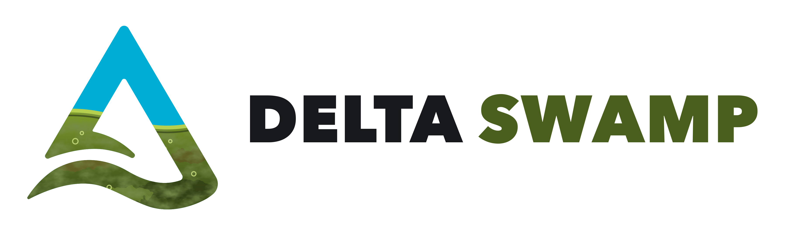

<picture>
  <source media="(prefers-color-scheme: dark)" srcset="assets/logo/deltaswamp-wordmark-dark.png">
  
</picture>

**One Python connector for every Delta table.** Unity Catalog managed and
external, Hive Metastore, Glue, Delta Sharing or a bare path: one object reads
and writes all of them.

```python
import deltaswamp as ds

conn = ds.connect()                      # Databricks auth, auto-detected
t = conn.table("main.sales.orders")

t.to_arrow(predicate="region = 'eu'")    # read, whatever the table is
t.append(df)                             # write, routed to an engine that can
t.delete("status = 'void'")              # DML, even on catalog-managed tables
```

## Why

Today every Delta table needs its own tool. `deltalake` handles paths, a SQL
warehouse handles managed tables, Spark handles anything catalog-managed,
Thrift handles Hive and boto3 handles Glue. Each has its own auth, its own
credential lifetime and its own opaque "unsupported table feature" error.

deltaswamp puts all of that behind `conn.table(name)`. Through its own binding
to delta-kernel-rs, it also opens `catalogManaged` tables, which no other Python
library can.

## How

The two open-source Delta engines fail in opposite directions. delta-kernel
reads tables delta-rs refuses (catalog-managed, type widening,
`vacuumProtocolCheck`, shredded variants) and writes through features that
block delta-rs, such as in-commit timestamps and liquid clustering. delta-rs
has MERGE, OPTIMIZE, VACUUM and RESTORE, and the kernel has none of them.

So deltaswamp routes each operation to the engine that can serve it. The
kernel reads, delta-rs writes and maintains, and a Databricks SQL warehouse
covers what neither can, but only if you opt in.

## It tells you before it fails

```python
>>> print(t.can("delete"))
delete: unavailable -- the table has row filter main.sec.only_eu, and Unity
Catalog vends no credentials for tables with row filters or column masks
(remedy: ds.connect(..., allow_sql_fallback=True))
```

`t.capabilities()` answers that question for every operation at once, without
performing any of them. Fallbacks are off by default, because a SQL warehouse
changes latency and cost by orders of magnitude.

## What it covers

- Every table shape: UC managed (catalog-managed included), UC external,
  Iceberg in UC, Delta Sharing, Hive Metastore, Glue and paths. Managed tables
  can be created and external ones registered.
- Reads with projection, SQL predicates, time travel, change data feed and
  file listing, all of them on kernel-only tables too.
- Writes and DML: append, overwrite, `replaceWhere`, dynamic partition
  overwrite, schema merge, idempotent writes, DELETE, UPDATE and MERGE.
- ALTER TABLE beyond delta-rs, such as renaming and dropping columns, type
  widening, SET NOT NULL and clustering keys.
- Maintenance: OPTIMIZE, Z-ORDER, VACUUM, RESTORE, FSCK, checkpoints and
  staged-commit publishing.
- Unity Catalog governance: grants, tags, ownership, lineage, constraints,
  volumes.
- Distributed reads and writes for Ray and other engines, plus hand-offs to
  DuckDB, Polars and Daft and cross-catalog SQL via `conn.sql(...)`.

The [feature map](docs/features.md) shows how each Databricks and open-source
Delta feature is reached, and names the blocker for the few that aren't.

## Install

```bash
pip install deltaswamp
pip install 'deltaswamp[pyarrow,polars,sql]'   # extras as needed
```

## Status

Alpha. Every feature is tested against real on-disk tables, a fake Unity
Catalog server that speaks the real `/delta/v1` protocol, and a Delta Sharing
server. A live Databricks suite runs with a personal access token.

The main gap: deletion vectors are not written yet, so DML on tables only the
kernel can write rewrites the whole table (up to a size bound). The
[changelog](CHANGELOG.md) lists the rest.

## Docs

- [Usage guide](docs/usage.md): the whole API
- [Architecture](docs/architecture.md): how it works and why
- [Conformance](docs/conformance.md): which engine serves which feature and operation
- [Feature map](docs/features.md): every Databricks and open-source feature, and how it is reached
- [Testing](docs/testing.md) and [Contributing](CONTRIBUTING.md)

## License

Apache-2.0. The logo is a parody of the [Delta Lake](https://delta.io) logo,
built on the original mark from
[delta-io/delta](https://github.com/delta-io/delta). Delta Lake is a trademark
of LF Projects, LLC; this project is not affiliated with or endorsed by the
Delta Lake project or the Linux Foundation.
